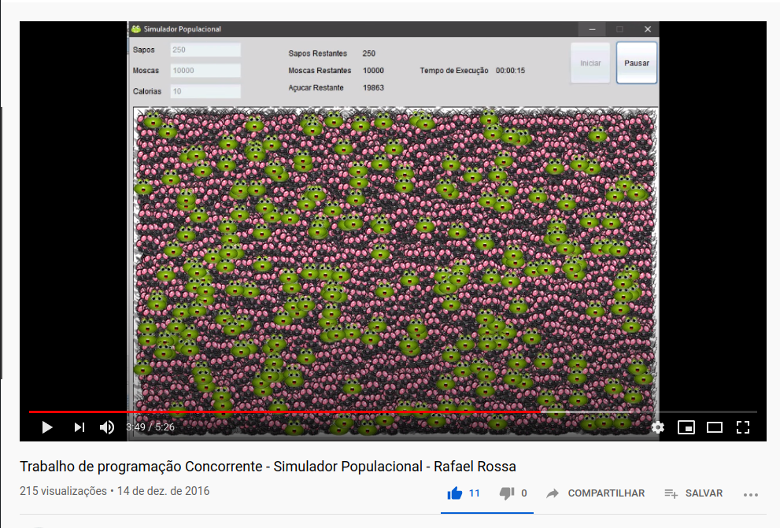

# Simulação de Dinâmica de População

>
>Trabalho de Programação Concorrente - SIS0564A (UCS - Universidade de Caxias do Sul)
>

**Aluno:** Rafael Rossa 
**Instituição:** Universidade de Caxias do Sul 
**Curso:** Bacharelado em Ciência da Computação 
**Disciplina:** Programação Concorrente 
**Professor:** André Luiz Martinotto 
**Implementado em Java com IDE Netbeans** 

**Fórum: <a href="https://bomrafinha.dev/programacao-concorrente-simulador-populacional/" target="_blank">https://bomrafinha.dev/programacao-concorrente-simulador-populacional/</a>**  

***Clique na Imagem para visualizar o vídeo***  

### Objetivo do Trabalho

O objetivo do trabalho consiste na implementação de um pequeno ecossistema formado por sapos, moscas e por açúcar.

### Descrição:

Depois de iniciar um programa, deverá ser apresentado um menu que permita adicionar moscas e sapos ao ambiente. O usuário poderá adicionar quantos sapos e moscas como desejar, sendo que esses indivíduos deverão ser gerados em posições aleatórias e deverão se movimentar aleatoriamente na tela, sem atravessar as bordas.
A quantidade de indivíduos e o tempo de simulação devem ser apresentados na tela. Os indivíduos deverão ser implementados como threads e compartilharão de um mesmo ambiente (como uma matriz, por exemplo).
A cada sapo é a associado um contador de calorias que é decrementado, sendo que o sapo morre quando o contador chegar a 0. Quando um sapo e uma mosca fizerem contato, a mosca morre e o contador de calorias do sapo é incrementado. O número de inicial calorias deverá ser fornecido pelo usuário no início do programa.
As moscas seguem o mesmo ciclo de vida de um sapo (mesmo número de calorias dos sapos), sendo que essas morrem de fome se não obterem comida (açúcar). Assim que uma mosca comer um lote de açúcar (ou seja, sua contagem de calorias exceder um limite pré-definido), ela irá se multiplicar automaticamente (ou seja, será gerado uma nova mosca). Já o açúcar deverá ser gerado aleatoriamente no ambiente e deverá ficar em posições fixas.

### Observações:
- Linguagens permitidas: Java, C#, C/C++, Python
- Grupos de no máximo dois alunos
- Trabalhos iguais serão zerados.

 

## Créditos 
[@bomrafinha](https://github.com/bomrafinha)

## [Licença](./LICENSE) 